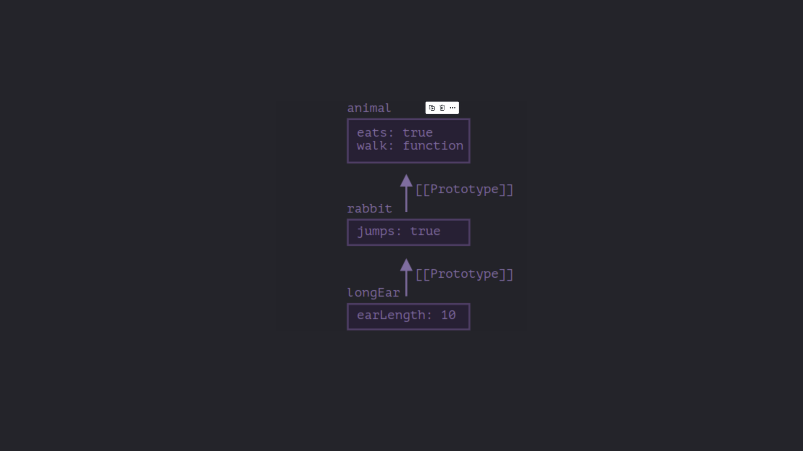

<a name="top"></a>

# Interview Questions

1. [What is event delegation, and how does it function in JavaScript?](#event-delegation-js)

2. [Can you provide an illustration of how ES6 has altered the approach to working with "this" in JavaScript?](#es6-and-this)

3. [Explain the concept of prototypal inheritance.](#prototypal-inheritance)

4. [Differentiate between a variable that is null, undefined, or undeclared.](#null-undef-undec)

5. [Define what a closure is and describe its uses and advantages.](#closures)

6. [Explain the primary distinction between the Array.forEach() loop and Array.map() method, as well as when to choose one over the other.](#map&forEach)

7. [What is a common scenario for employing anonymous functions?](#anonymous-fn)

8. [Distinguish between host objects and native objects.
   -Clarify the distinctions among 'function User(){}', 'var user = User()', and 'var user = new User()](#host-native)

9. [Can you explain the purposes of Function.call and Function.apply, along with their notable differences?](#call-apply)

10. [Describe the Function.prototype.bind method.](#bind)

11. [Explain the differences between feature detection, feature inference, and utilizing the User Agent (UA) string.](#fa-fi-ua)

12. Define the concept of "hoisting."

13. [What is type coercion, and what are some common pitfalls associated with relying on it in JavaScript code?](#coercion)

14. [Describe event bubbling and event capturing.](#event-bub-cap)

15. What distinguishes an "attribute" from a "property"?

16. List the advantages and disadvantages of extending built-in JavaScript objects.

17. Explain the differences between == and ===.

18. Discuss the same-origin policy's implications for JavaScript.

19. Why is it referred to as a "Ternary operator," and what does the term "Ternary" signify?

20. Define strict mode and outline some of its advantages and disadvantages.

21. Analyze the pros and cons of writing JavaScript code in a language that compiles to JavaScript.

22. What tools and techniques do you employ for debugging JavaScript code?

23. Enumerate the benefits and drawbacks of immutability and explain how you can achieve it in your code.

24. Differentiate between synchronous and asynchronous functions and elucidate the event loop.

25. Explain the disparities between variables created using let, var, or const.

26. Compare ES6 classes and ES5 function constructors, and furnish a use case for the arrow (=>) function syntax.

27. Describe the advantages of using the arrow syntax for methods in constructors.

28. Define a higher-order function and provide an example of object or array destructuring.

29. Give an example of generating a string using ES6 Template Literals and explain their benefits.

30. Provide an example of a curry function and clarify why this syntax can be advantageous.

31. Discuss the benefits of using spread syntax and differentiate it from rest syntax.

32. [Explain debounce vs throttling.](#throttleVSdebounce)

33. Define what a promise is and describe its applications.

34. Explore how Object-Oriented Programming (OOP) principles can be applied when coding in JavaScript.

# Answers/Solutions

**1. Event Delegation in JS**
</br>
<a name="event-delegation-js" ></a>
Event delegation is a technique in javascript where instead of handling individual events on child elements, you add a handler on the parent which handles events for all the child elements. This technique works on the concept of event bubbling where an event object gets created when an event occurs and travels down to the target object and then bubbles up. It is in the bubbling phase that the event is caught by the event listener attached to the parent.</br>
<b>It can prove to be optimal as it reduces the need of attaching a lot of event listeners which can make the application slow</b>

```html
<div id="parent">
  <button>child1</button><button>child2</button
  ><button>child3</button>
</div>
<script>
  const parent =
    document.getElementById("parent");
  parent.addEventListener("click", (e) => {
    alert(e.target.textContent);
  });
</script>
```

[Back to top ⬆️](#top)

**2. ES6 and the this keyword**
</br>
<a name="es6-and-this" ></a>
ES6 introduced several features that has affected how developers work with the `this` keyword in Javascript, particularly with the introduction of arrow functions and lexical scoping

<li><b>Arrow Functions</b></li>
</br>
Arrow functions don't get their own this keyword and inside these functions, the `this` keyword is lexically scoped, that is, it inherits the `this` value from the surrounding code.

```javascript
let obj = {
  name: "faheem",
  age: 25,

  func1() {
    console.log(this.name);

    const new_func = () => console.log(this.age);
    const new_func_1 = function () {
      console.log(this.age);
    };

    new_func();
    new_func_1();
  },

  func2: () => {
    console.log(this.age);
  },
};

obj.func1();
//faheem
//25
//undefined
obj.func2();
//undefined
```

**Explanation**
</br>
When `func1` is called by the obj, the `this` inside the func1 points to the obj where as the `new_func` being an arrow function doesn't get it's own `this` keyword, gets it from the surrounding code where `this===obj`.
</br>
In case of `new_func_1`, it is a normal function and it is invoked normally and as such the `this` keyword inside the `new_func_1` is `undefined`.
</br>
In case of `func2`, `this` inside func2 points to the global object and as such `this.age` is undefined.

[Back to top ⬆️](#top)

**3. Prototypal inheritance in JS**

<a name="prototypal-inheritance" ></a>
The general concept of inheritance is to extend a property or a method from a parent down to it's children.
Prototypal inheritance is the linking of prototypes of a parent object to share the properties
and methods of a parent class with child classes.Prototypes are hidden objects that are used to share properties and
methods from a parent class to it's child classes.

**[[Prototype]]**
In JavaScript, objects have a special hidden property `[[Prototype]]`, that is either `null` or references another object. That object is called **“a prototype”**.

When we read a property from an `object`, and it’s missing, JavaScript automatically takes it from the prototype. In programming, this is called **“prototypal inheritance”**.

The property `[[Prototype]]` is internal and hidden, but there are many ways to set it.

One of them is to use the special name `__proto__`. Few things to consider about `__proto__`:

- It is a getter/setter for the `[[Prototype]]` object but is deprecated.
- It can either be an object or null.
- We can't have circular referrences. Javascript will throw an error if we try to do so.

Javascript recommends to use `Object.getPrototypeOf/Object.setPrototypeOf` functions instead to get/set the prototype.



```javascript
let animal = {
  eats: true,
  walk() {
    alert("Animal walk");
  },
};

let rabbit = {
  jumps: true,
  __proto__: animal,
};

let longEar = {
  earLength: 10,
  __proto__: rabbit,
};

// walk is taken from the prototype chain
longEar.walk(); // Animal walk

alert(longEar.jumps); // true (from rabbit)
```

**Summary**

- In JavaScript, all objects have a hidden `[[Prototype]]` property that’s either another object or null.

- We can use`obj.__proto__` to access it (a historical getter/setter).

- The object referenced by `[[Prototype]]` is called a “prototype”.

- If we want to read a property of obj or call a method, and it doesn’t exist, then JavaScript tries to find it in the prototype.

- Write/delete operations act directly on the object, they don’t use the prototype (assuming it’s a data property, not a setter).

- If we call obj.method(), and the method is taken from the prototype, **this still references obj**. So methods always work with the current object even if they are inherited.

- The `for..in` loop iterates over both its own and its inherited properties. All other `key/value-getting methods` only operate on the object itself.

[Back to top ⬆️](#top)

**4. Null, Undefined and Undeclared variables in JS.**

<a name="null-undef-undec" ></a>

- `Null`: Represents an intentional absence of a value.It is a value that has to be explicitly assigned to a variable.

```javascript
let example = null;
console.log(example); // Output: null
```

- `Undefined`: A variable that has been declared but has not been assigned any value. When you declare a variable
  without assigning a value to it, JavaScript automatically initializes it with undefined.
  **This is the reason why `const` variables always need to be intialised at the time of declaration.**

```javascript
let example;
console.log(example); // Output: undefined
```

- `Undeclared` : A variable that has been used without being declared using `var`, `let`, or `const`. This often
  leads to a ReferenceError in JavaScript.

```javascript
console.log(a); //Referrence Error: a is not defined
```

[Back to top ⬆️](#top)

**5. Closures in JS**

<a name="closures" ></a>

A fundamental concept in JS that refers to the ability of a function to close over or retain the referrences of
it's outer scope even if the outer function's execution has finished. So, in other words,
`a closure allows a function to close over and capture the environment in which it was created.`

**Example**

```javascript
function a() {
  const variable = "hello";

  return () => {
    console.log(variable);
  };
}

const b = a();
b();
/*hello will be logged onto the system console despite a being out of the function call stack
  the referrence of the variable is retained by the function returned and not garbage collected
*/
```

**Uses** - It has a lot of uses but the most important ones are :

- Encapsulation and Data Privacy:

  Closures allow you to create private variables and methods by enclosing them within a function.
  This helps in preventing direct access to these variables from the outside world, achieving a
  level of encapsulation and data privacy.

  ```javascript
  function counter() {
    let _count = 0;

    return {
      increment() {
        _count++;
      },
      decrement(){
        _count--;
      }
      get count(){
        console.log(count);
        return count;
      }
    };
  }

  const counterFunc = counter();
  counterFunc.increment();
  counterFunc.increment();
  counterFunc.increment();

  let curr_count = counterFunc.count;
  console.log(curr_count);//3

  counterFunc.decrement();
  counterFunc.decrement();

  curr_count = counterFunc.count;
  console.log(curr_count);//1

  ```

- Function currying and partial application

  Closures enable the creation of functions with preset arguments, leading to partial application and currying.

  ```javascript
  function multiply(a, b, c) {
    return a * b * c;
  }

  function curryMultiply(a) {
    return function (b) {
      return function (c) {
        return a * b * c;
      };
    };
  }

  const double = curryMultiply(2)(1);
  const triple = curryMultiply(3)(1);

  console.log(double(6)); //12
  console.log(triple(5)); //15
  ```

[Back to top ⬆️](#top)

**6. Array.forEach() & Array.map()**

<a id="map&forEach" ></a>

Both are methods to iterate over arrays and both take a callback, which is invoked by
the method itself. These methods and their callbacks have a similar function signature,
that is, `map(callbackFn, thisArg), forEach(callbackFn, thisArg)` and for the callback,
the function signature is `function(element,index,array)`

However, there are certain differences. These are:

1.  The returning value
    The `forEach()` method returns `undefined` and `map()` returns a `new array with the transformed elements`.

2.  Method Chaining
    `map()` is chainable where as `forEach()` isn't as the latter returns undefined and the former returns a new
    array.

3.  Mutability
    `forEach()` does not mutate the array on which it is called. (However, `callback` may do so).
    You can make use of the index and the array that is being passed into the callback to mutate the
    original array.

    `map()` does not mutate the array on which it is called (although `callback`, if invoked, may do so).
    Here, also you can mutate the original array by making use of the index and the array itself which gets
    passed into the callback.

4.  `forEach()` can be used on a nodelist where as `map()` can't be.

[Back to top ⬆️](#top)

**7. Anonymous function use cases**
<a id="anonymous-fn"></a>
There are a lot of use cases for employing anonymous functions(nameless functions) and
these are :

1.  Assigning a function to a variable

```javascript
const add = function (a, b) {
  return a + b;
};
```

2.  Defining IIFE's(Immediately Invoked function expressions)

```javascript
(function () {
  console.log("init");
  //Initialization done here
})();
```

3.  Passing as Callbacks to Higher Order functions or Registering Handler functions

```javascript
//Attaching an event handler
btn.addEventListener("click", function () {
  console.log("clicked");
});

const nums = [1, 2, 3, 4];
const transformedNums = nums.map(function (el) {
  return el * 2;
});
```

[Back to top ⬆️](#top)

**8. Host Objects and Native Objects**
<a id="host-native"></a>

1. Native Objects: These are objects that are built into javascript language itself.
   Examples include `Objects`,`Array`, `Function`, `String`, `Number`, `Boolean`, etc.

2. Host Objects: These are the objects provided by the environment in which  
   javascript is running. Examples include `window`(browser), `document`,`console`,
   `setTimeout`(both in browser and node) etc.

3. `function User(){}` vs `var user = User()` vs `var user = new User()`

- `function User(){}` : This is a simple function declaration. It defines a  
   function `User` which can be later called in the code.

- `var user = User()` : This assigns the result of calling `User()` in the variable
  `user`.

- `var user = new User()` : This creates a new instance of the `User` object using
  the `new`. When a function is invoked using the `new` keyword, it creates a new object, sets the `this` keyword to point to that object within the function context and returns the newly created object.

[Back to top ⬆️](#top)

**9. Function.call and Function.apply**
<a id="call-apply"></a>
Both the methods call a function with the first argument as the owner of the function, but `apply` is different from `call` in a sense that it takes arguments as an array.

```javascript
const obj = {
  name: "faheem",
  age: 25,
};

const getDetails = function () {
  console.log(
    `I am ${this.name} and i am ${this.age} years old.`
  );
};

getDetails.call(obj, 2, 3, 4, 5, 6);
getDetails.apply(obj, [2, 3, 4, 5, 6]);
```

**10. Function.protottype.bind**

<a id="bind"></a>
The `bind` method on the `Function.prototype` returns a function with a bound context, that is,
the `this` keyword is fixed and points to a specific context.

Function signature - `bind(thisArg, arg1, arg2, /* …, */ argN)`

```javascript
const person = {
  name: "Alice",
  greet: function () {
    console.log(`Hello, my name is ${this.name}`);
  },
};

const greetFunc = person.greet;
greetFunc(); // Undefined, because 'this' refers to the globalThis

const boundGreetFunc = person.greet.bind(person);
boundGreetFunc(); // "Hello, my name is Alice"
```

```javascript
class ButtonHandler {
  constructor(name) {
    this.name = name;
  }
  handleClick() {
    console.log(`Button clicked by ${this.name}`);
  }
}
const handler = new ButtonHandler("Alice");
document
  .querySelector("button")
  .addEventListener(
    "click",
    handler.handleClick.bind(handler)
  );

//without the bounded function, this would point to the dom element calling the handler function
```

```javascript
function multiply(a, b) {
  return a * b;
}
const double = multiply.bind(null, 2); // Partially applying the first argument
console.log(double(5)); // Outputs 10
```

```javascript
class User {
  constructor(name) {
    this.name = name;
  }
  async fetchData() {
    setTimeout(this.showName.bind(this), 1000); // Retain `this` in the callback
  }
  showName() {
    console.log(this.name);
  }
}
const user = new User("Alice");
user.fetchData(); // Outputs "Alice" after 1 second

//if not for the bounded function, the this would refer to the globalThis after
//being called a certain time has elapsed by the setTimeout
```

**Uses**

1.  It helps avoiding potential bugs while dealing with asynchronous code where the functions are
    passed to be executed later on after some event or after a timeout.

2.  It can also be used for partial applications, thus making it simpler to create functions with predefined arguments

[Back to top ⬆️](#top)
<br />
<br />

**11. Feature detection, Feature inference and User-Agent string**

<a id="fa-fi-ua"></a>

1.  Feature Detection : a technique that tests whether a specific feature is supported by the browser, rather than checking the browser itself. This method directly checks if a particular API or capability is available before using it, avoiding potential compatibility issues.

```javascript
if ("geolocation" in navigator) {
  // Browser supports geolocation API
  navigator.geolocation.getCurrentPosition(
    showPosition
  );
} else {
  // Geolocation not supported
  alert(
    "Geolocation is not supported by your browser."
  );
}
```

2.  Feature inference : It assumes that a browser supports a feature based on the presence of another similar feature, rather than directly testing the feature itself. This approach is less reliable because not all browsers implement related features in the same way.

```javascript
// Assuming that if 'document.querySelector' is available, 'document.querySelectorAll' is also available.
if (document.querySelector) {
  // Infer that `querySelectorAll` is also supported
  document.querySelectorAll(".class");
}
```

3.  User-Agent string : a text string that browsers send to identify themselves to web servers. It includes details about the browser, its version, the operating system, and sometimes the device. Parsing the UA string allows developers to identify the browser and version to make compatibility decisions, although it’s generally the least reliable approach due to potential inconsistencies.

```javascript
const ua = navigator.userAgent;
if (/Firefox\/\d+/.test(ua)) {
  // This is Firefox
} else if (/Chrome\/\d+/.test(ua)) {
  // This is Chrome
}
```

<br />

**13. Type Coercion and its pitfalls**

<a id="coercion"></a>
Type coercion is simply automatic or implicit conversion of one data type into the other.
It is sometimes desirable but if not careful about it can lead to potential pitfalls.

**Common Pitfalls in JavaScript Type Coercion** :

1.  **String and Number Coercion**

```javascript
console.log("5" - 2); // 3 (string "5" is coerced to number 5)
console.log("5" + 2); // "52" (number 2 is coerced to string "2")
```

**pitfall**: Unexpected calculation results

2.  **Falsy Values**

- JavaScript treats certain values as "falsy," meaning they coerce to false in a boolean context:
- Falsy values include: `0`, `""`, `null`, `undefined`, `NaN`, and `false`.

```javascript
function checkInitialValue(initial) {
  if (initial) return true;
  return false;
}
const bool1 = checkInitialValue(0); //false - although the initial value being assigned
const bool2 = checkInitialValue(""); //false - although the initial value being assigned
```

**Pitfall**: Misinterpreting falsy values can cause issues, especially with numbers.
For example, 0 is falsy, so conditions relying on numbers may fail if they expect 0 to be truthy.

3.  **Comparisons with == (Loose Equality)**

- `==` checks for equality with coercion, whereas `===` checks for strict equality without coercion.

```javascript
console.log(0 == ""); // true (both are coerced to falsy)
console.log(null == undefined); // true (both are considered equivalent)
console.log("5" == 5); // true (string "5" is coerced to number 5)

console.log([] == ""); // true (array is coerced to empty string)
console.log([1, 2] == "1,2"); // true (array is coerced to string "1,2")
```

**Objects and arrays are coerced to strings when compared to non-object types, which can lead to unexpected behavior.**

**Pitfall**: Loose equality (==) often leads to unexpected matches due to coercion.
This can introduce bugs if two seemingly unequal values are treated as equal.

4.  **`NaN` Comparisons**

- `NaN (Not-a-Number)` is a special numeric value that indicates an invalid number.

```javascript
console.log(NaN == NaN); // false
console.log(NaN === NaN); // false
console.log(isNaN("abc")); //true
```

**Pitfall**: `NaN` is not equal to anything, not even itself. Checking if a value is `NaN` requires using `Number.isNaN()` or `isNaN()`. Misunderstanding this can lead to incorrectly assuming a `NaN` value is equal to another.

<br />

**32. Throttle vs Debounce**

<a id="throttleVSdebounce"></a>

1.  Throttle : An optimisation technique that limits the execution of a function at once in
    every specified time interval. **Example** - Updating the layout while resizing the window,
    we can throttle the `updateLayout` function in order to prevent the page from becoming
    unresponsive and cranky.

2.  Debounce: An optimisation technique that delays the execution of a function until the user
    stops performing a ceratin action for a specified amount of time. **Example** -A function
    that fetches suggestions from an endpoint when the input gets changed makes way too many
    network requests and thus to avoid this, we can debounce it.

**Throttle Implementation**

```javascript
function throttle(fn, delay) {
  let lastCall = 0;

  return function (...args) {
    let now = Date.now();
    if (now - lastCall < delay) return;
    fn(...args);
    lastCall = now;
  };
}

const throttleResizeFunc = throttle(
  () => console.log("Resizing"),
  5000
);
//Here the lastCall is in the closure and thus it's referrence is always retained.

window.addEventListener(
  "resize",
  throttleResizeFunc
);
```

**Debounce Implementation**

```javascript
function debounce(fn, delay) {
  let debId = null;

  return function (...args) {
    clearTimeout(debId);
    debId = setTimeout(() => {
      fn(...args);
    }, delay);
  };
}

const debounceInputLogging = debounce(
  () => console.log("logging"),
  3000
);

inp.addEventListener(
  "change",
  debounceInputLogging
);
```

[Implementing debouncing and throttling in React🔗](./throttleVSdebounce-react.jsx)

[Back to top ⬆️](#top)
